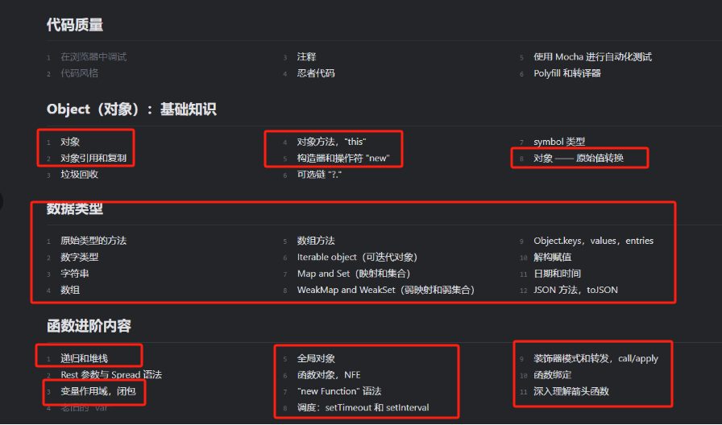

# 编程语言之旅: JavaScript

### 学习目标

- ECMAScript 基本语法
- DOM编程
- BOM的使用
- 作用域、闭包、原型链
- 事件代理/委托
- 错误处理/异常处理
- 事件队列 (setTimeout/setInterval/Promise)
- JSON
- Ajax/Fetch
- ES6+
- 正则表达式

- ## [JavaScript 入门](1_introduction/README.md)
    - ### [JS 入门: 基本语法](1_introduction/1_vocabulary/README.md)

